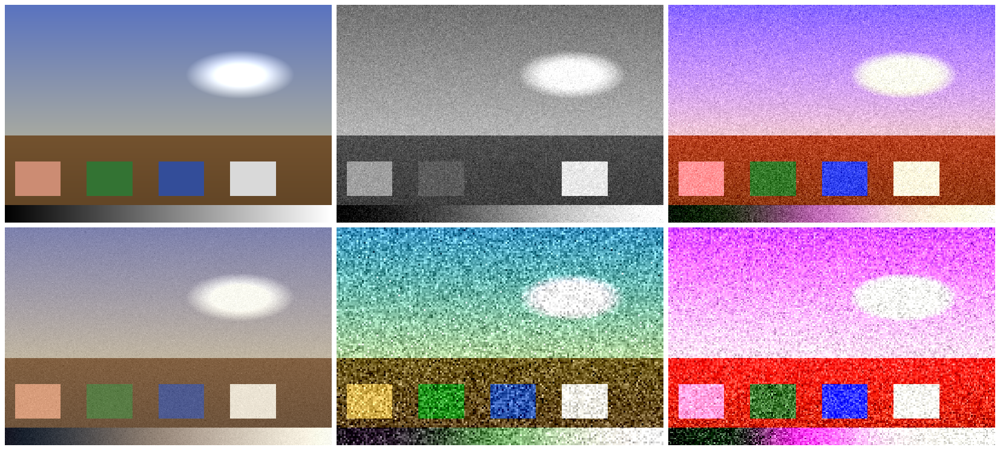

# cross_processing

A repository exploring the deliberate misuse of photographic chemistry —
**cross-processing (X-pro)**, the practice of developing film in the wrong
chemicals to create unpredictable color shifts, high contrast, and surreal
tones. This is about breaking the rules of color reproduction and finding beauty
in the chemical accident. The goal is not to *correct* color but to *distort* it
with intent.

> The chemistry is wrong. The colors are lying. The mistake is the masterpiece.



*Top: input · C-41-in-E-6 · B&W-in-C-41. Bottom: E-6-in-C-41 · expired · push.
Regenerate with `python tools/make_gallery.py`.*

---

## What's in here

This is a creative-coding toolkit for the cross-process aesthetic, in three
layers that share one model of the look:

- **`shaders/`** — real-time GLSL (WebGL1) shaders for each cross-process style.
- **`tools/`** — Python CLIs (numpy + Pillow) to apply/bake/extract looks and
  generate 3D LUTs.
- **`notebooks/`** — Jupyter notebooks that simulate the chemistry, generate
  LUTs, and analyze color shifts.

Plus a runnable **`web/`** viewer, **`references/`** on the underlying
chemistry, ready-made **`presets/`**, and example **`gallery/`** renders.

## Quick start

### Run the shaders in the browser
```bash
# from the repo root
python -m http.server
# open http://localhost:8000/web/
```
Pick a shader, drop in an image (a synthetic one loads by default), tweak the
uniforms, and **Save PNG**.

### Use the Python tools
```bash
pip install -r requirements.txt

# Apply a preset to an image
python tools/xpro_lut_applier.py photo.jpg out.jpg --preset c41_in_e6 --amount 0.85

# Batch a folder, with per-image variation ("one unique roll per frame")
python tools/xpro_batch_processor.py ./in ./out --preset push_xpro --jitter 0.15

# Bake a preset to a .cube LUT (for Photoshop / Lightroom / Resolve / OBS)
python tools/xpro_lut_applier.py --preset e6_in_c41 --export-cube e6_in_c41.cube

# Extract a profile from a real scan (paired with a normal version if you have one)
python tools/xpro_profile_extractor.py scan_xpro.jpg profile.json --reference normal.jpg

# Make a split-tone look (cyan shadows, orange highlights by default)
python tools/split_tone_generator.py photo.jpg out.jpg

# Regenerate the gallery
python tools/make_gallery.py
```

## The looks

| Shader | Real-world equivalent | Character |
|--------|----------------------|-----------|
| [`c41_in_e6`](shaders/c41_in_e6.frag) | C-41 negative film in E-6 slide chem | High contrast, magenta skies, green skin, yellow shadows, heavy grain |
| [`e6_in_c41`](shaders/e6_in_c41.frag) | E-6 slide film in C-41 negative chem | Muted, pastel, low contrast, faded; peach mids, cyan shadows |
| [`bw_in_c41`](shaders/bw_in_c41.frag) | B&W film in C-41 color chem | Monochrome with warm tint and C-41 grain |
| [`push_processed_xpro`](shaders/push_processed_xpro.frag) | Pushed cross-process | Extreme shifts, blown highlights, crushed blacks, huge grain |
| [`expired_film_xpro`](shaders/expired_film_xpro.frag) | Expired film, cross-processed | Spatially chaotic shifts, uneven contrast, random grain |
| [`tungsten_daylight`](shaders/tungsten_daylight.frag) | Tungsten film shot in daylight | Cold blue cast, deep blue shadows, warm highlights |
| [`daylight_tungsten`](shaders/daylight_tungsten.frag) | Daylight film under tungsten | Warm orange cast, 1970s/candlelight feel |
| [`selective_cross_process`](shaders/selective_cross_process.frag) | Masked cross-process | Effect applied only to part of the frame |
| [`digital_xpro_lut`](shaders/digital_xpro_lut.frag) | LUT-based simulation | Tone-blended 3D LUTs (shadow/mid/highlight) |
| [`split_tone_xpro`](shaders/split_tone_xpro.frag) | Natural X-pro split-tone | Cyan shadows / orange highlights, smooth crossover |

## How the model works

Real cross-processing is **non-linear and exposure-dependent**: shadows,
midtones, and highlights shift toward *different* colors because each emulsion
layer's characteristic curve is distorted by a different amount in the wrong
chemistry (see [`references/color_film_layers.md`](references/color_film_layers.md)).

A flat color grade can't capture that. So both the shaders and
[`tools/xpro_core.py`](tools/xpro_core.py) use **tone-dependent transforms**:
per-region additive color shifts → a per-channel S-curve → saturation → grain.
The same parameters (`XproProfile`) drive the Python tools, the presets, and the
shader uniforms, so a look you find in a notebook can be baked to a `.cube` LUT
or dialed into the GLSL viewer.

## Repository structure

```
├── shaders/            GLSL (WebGL1) cross-process shaders
│   └── lib/common.glsl shared helpers (prepended by the viewer)
├── tools/              Python CLIs + shared xpro_core module
├── notebooks/          Jupyter: simulate, generate LUTs, analyze, plot curves
├── web/                browser-based shader viewer (index.html + viewer.js)
├── presets/            ready-made XproProfile .json presets
├── references/         the chemistry behind the looks
├── gallery/            example renders (generated)
├── tests/              pytest suite for xpro_core
├── docs/repo_seed.txt  original design seed (provenance)
└── requirements.txt
```

## Conventions for the shaders

Each `.frag` declares only **its own** uniforms and `main()`. The viewer
prepends a standard header (`precision`, `u_image`, `u_resolution`, `u_time`,
`v_uv`) and `shaders/lib/common.glsl` before compiling. To compile a shader by
hand, paste that header + `common.glsl` above the shader body. Common uniforms:

- `u_image` — input texture
- `u_resolution` — image size in pixels (for grain scale)
- `u_time` — seconds since load (for animated shaders like `expired_film_xpro`)

## Development

```bash
pip install -r requirements.txt
pytest -q                      # run the test suite
python tools/make_gallery.py   # regenerate gallery renders
```

See [`CONTRIBUTING.md`](CONTRIBUTING.md) for how to add a new look (a shader, a
preset, and a gallery render — keep all three in sync).

## License

[MIT](LICENSE).
